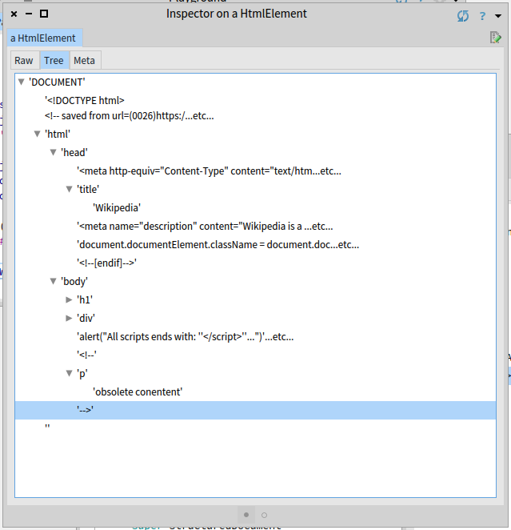
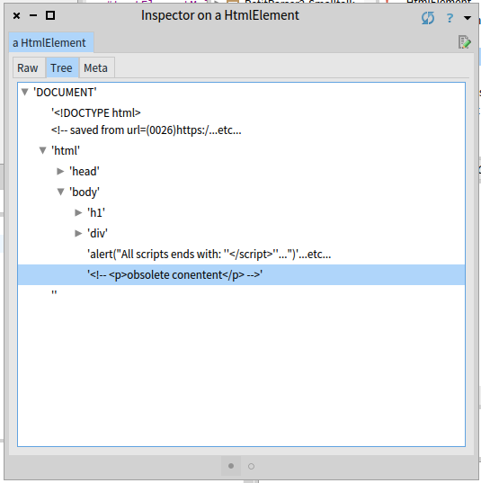

# Comments

Code comments may contain scripts or other elements that are not part of the HTML document (they are just comments, right?). 

## Find a Bug
There is an error in ```WebParser``` that we have not found. 
It extracts one extra HTML element, which is not part of the HTML document.
Inspect the following and switch to the tree view:

```smalltalk
WebParser new parse: input.
```

There is a ''<p>'' element in the ''<body>''. 
But ''<p>'' is a part of a comment, it should not be included in the document structure. 





First, we should fix the ```testStructuredDocument``` to cover this case:

<!--
t sourceFor: #testStructuredDocument in: WebParserTest.
-->
```smalltalk
WebParserTest>>testStructuredDocument
  | html body |
  super testStructuredDocument.
  
  self assert: result name equals: 'DOCUMENT'.

  html := result secondChild.
  self assert: html name equals: 'html'.

  self assert: html firstChild name equals: 'head'.  
  self assert: html secondChild name equals: 'body'.
  
  body := html secondChild.
  self assert: body children size equals: 4.
```

## Where does the problem come from?
```WebGrammar``` has no notion of a comment and handles a content of a comment as an ordinary html code. 
In order to teach the grammar, we have to define comment first:

<!--
t := PP2Tutorial new.
t sourceFor: #comment in: WebGrammar.
-->
```smalltalk
WebGrammar>>comment
  ^ '<!--' asPParser, any starLazy, '-->' asPParser
```

And now we can redefine ```text``` so that it takes comments into an account:
<!--
t sourceFor: #text in: WebGrammar.
-->
```smalltalk
WebGrammar>>text
	^ (comment / any) starLazy
```

Now tests pass and AST looks good:





## Summary
Parsers unaware of comments sooner or later return wrong results. 
We fixed the issue by specifying the ```comment``` rule, which properly skips over comments in input.

### Sources
The sources of this tutorial are part of the PetitParser2 package, you just need to install PetitParser2 or use Moose as described in the [introduction](index.md).

