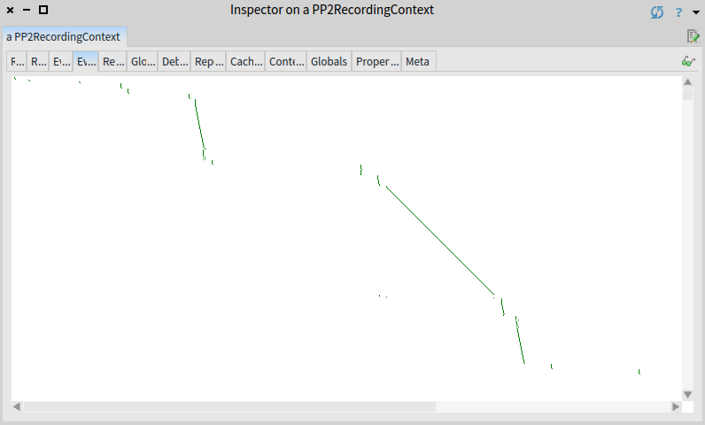

# Manual Memoization



In the previous [chapter](optimizations.md) we greatly improved the performance of our parser by calling ```optimize``` method. 
Let's try the real sources then.
The home page of we [wikipedia](https://wikipedia.org), [github](https://github.com), [facebook](https://facebook.com) and [google](https://google.com) can be parsed invoking this commands:

```smalltalk
sources := PP2Sources current htmlSourcesAll.
parser := WebParser new optimize.
sources collect: [ :s |
	parser parse: s.
]
```

Unfortunately, this still takes too much (event with the automated optimizations). 
Can we do something, that the optimizations can't? 
Usually, hard to say. 
It depends on the nature of a grammar and input to be parsed.
In this case, we can really improve the performance (obviously, we wouldn't write this chapter otherwise).

### Trace View
It is a good time to check the events morph of a debug result. 
Events morph shows timeline of parser invocations (dot) at a given position (x axis) in a given time (y axis).
Inspect the result of the following command again and switch to *Events* view.

```smalltalk
WebParser new optimize debug: input.
```

<a id="optimizedTrace" />


On the screenshot in there is only a part of the story (the part that fits into a single window).
The whole story is that parsing progress fast towards the end of input (this is the good part),  but suddenly parser jumps back to the beginning of input and starts again. 
Over and over again (this is the bad part).



Even though optimizations in PetitParser2 work reasonably well, not all of them can be applied automatically and must be done by poor humans.
Luckily, there are tools to help those humans. 

For the convenience of the visualization, we will use a compacted and simplified input.
```smalltalk
compact := '
<!a>
<h>
<m foo>
<m e>
<b>
Lorem ipsum donor sit amet
</b>
</h>
'.
WebParser new optimize debug: compact.
```

<a id="compactTrace" />


## Searching for the cause

In the events morph we see how does the parser backtrack, over and over. 
We have to do a bit of detective work to figure out when and why. 
Let us navigate through the parsing until the HTML body (represented by the ```b``` element in the *compact* input) is parsed:


Now switch to the traces tab:


The yellow rectangle in the preivious figure highlights 872 underlying invocations of the ```element``` rule. 
The dark red rectangle highlights another invocations of the same ```element``` rule that started at the same position. 
And we see there are quite a few of them. 

In general, one does not want to see repeating dark-red rectangles, and the more of them or the higher these dark-red rectangles are, the worse. 
It simply means redundant computations. 
Remember, each pixel on the y-axis is a parser invocation.






## Fixing the Cause
Solution to this case is called memoization. 
To suggest PetitParser2 to add memoization, add a ```memoize``` keyword to the ```element``` rule.



```smalltalk
WebGrammar>>element
	^ (elOpen, elContent, elClose)
		memoize;
		yourself
```
<!--
@@note Please note currently PetitParser2 does not support memoizations of push and pop parsers. The *"neutral"* parsers, for example a sequence of push and pop, as in the case of the ```element``` rule, can be memoized.
-->

Let us check the result now:

```smalltalk
WebParser new optimize debug: compact.
```


The shows what we want to see: no repeated invocations, no superfluous backtracking. 






## Parsing Real Sources
Finally, we can parse big sources as well, they should be parsed in a reasonable time now:

```smalltalk
sources := PP2Sources current htmlSourcesAll.
parser := WebParser new optimize.
sources collect: [ :s |
	parser parse: s.
]
```

## Conclusion
Momoziation reduced exponential parsing time complexity to a linear complexity.
Memoization is hard to apply automatically, therefore PetitParser2 provides tools to identify which parsers should be memoized.

### Sources
The sources of this tutorial are part of the PetitParser2 package, you just need to install PetitParser2 or use Moose as described in the [Introduction](index.md).
