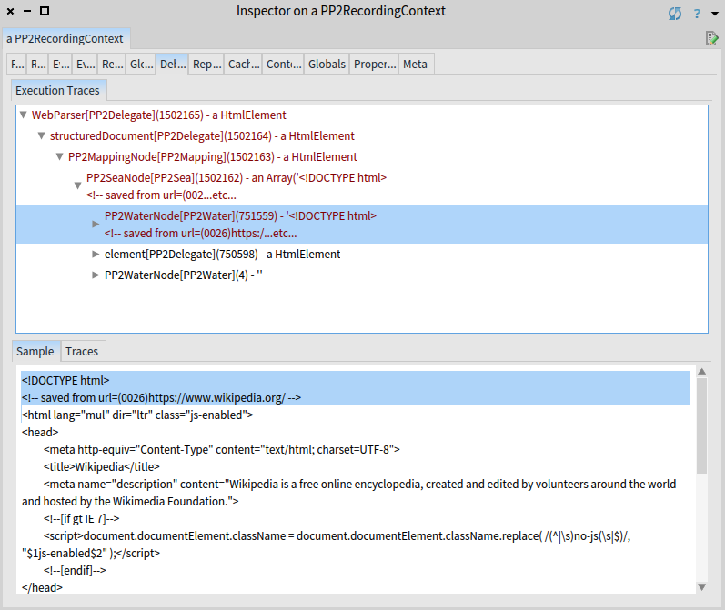
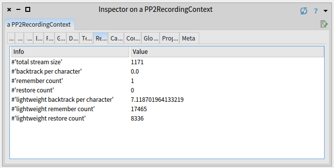
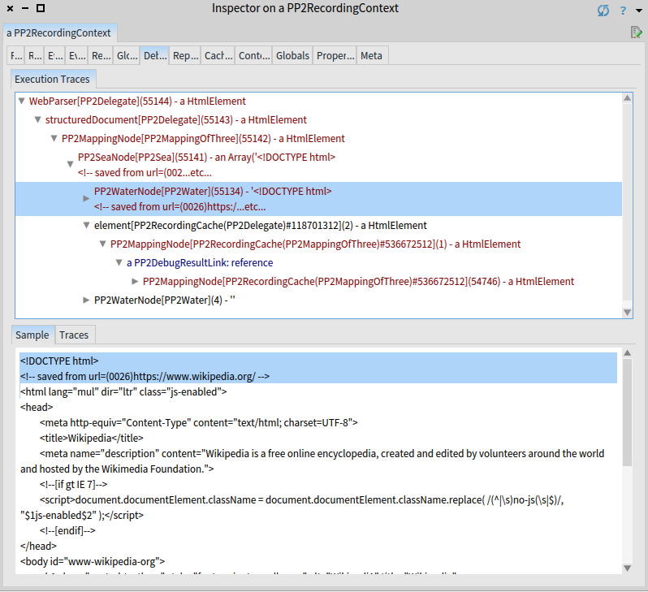

# Optimizations Overview



## Basic Analysis
When running the ```testStructuredDocument```, you might have noticed that the performance is not good. 
It is actually terribly bad. Let us inspect in in detail:

```smalltalk
input := PP2Sources current htmlSample.
WebParser new debug: input.
```

### Report View
This will run the parser in a debug mode and collect a lot of useful information. 
Unfortunately, it also takes considerable amount of time so be patient. 
Once you get the result, inspect the *Report tab* (numbers might slightly differ in your case):

<a id="unoptimizedReport" />


{% include note.html content="
Based on the image, the total stream size is 1171 characters. 
The parser has remembered the full context 510197 times and restored 387667 times. 
This means that the full copy of the context (including the stack of opened elements, which we use to match open and close tags) has been created 510197 times and the context has been restored from this full copy (by doing another copy) 387667 times. 
This is in average 331 backtrackings per consumed character. 

Some of the parsers didn't copied full context. 
These are prefixed with *lightweight*. 
In the lightweight case, only the position is remembered and restored (which is much faster than the full copy of a stack). 
This happened in average 92 times per character.
"%}

Honestly, these numbers are brutal. 
In ideal case, the number of full restores should be zero. 
Full remember and restore is very expensive. 
Very often only lightweight remember and restore happens, since many grammars are context-free, i.e. they do not use ```push```, ```match``` and ```pop``` operators. 

Regarding the lightweight backtracking, the average of lightweight backtracks per character should be below 1 (in ideal case). 
This typically happens for deterministic grammars, which do not do any (or only a little) speculations and do know exactly which alternative of a choice is the correct one. 

### Debug View
Our grammar is obviously not deterministic: it does lots of speculations.
Why are the numbers so bad in our case? 
Inspect in more detail how this was happening, use the *Debug view*:

<a id="unoptimizedDebug" />




Numbers are too high for a short input. 
Such a bad performance is caused by the fact that bounded seas have to verify at every position if the next parser (i.e. the parser that will be invoked after the sea) will succeed. 
If the next parser happens to be another sea (as in the case of ```WebGrammar```), the number of invocations grows really fast (exponentially in fact). 


We see that the ```element``` rule took approximately one half of the invocations (750598). 
Majority of 751559 invocations of before water were spent by testing for element. 

Another glimpse of ineffectiveness can be seen in the ```elOpen``` rule.

<a id="unoptimizedElOpen" />


The whole *<html lang="html" dir="ltr" class="js-enabled">* is parsed by invoking 272 parsers.
This is quite a lot for a line with 55 characters.
One of the reasons is how are the identifiers (```elementName```) parsed.
You can see that when recognizing the *html* text, 8 different parsers are invoked; for each letter one and some extra boilerplate parsers (flattening, possessive repeating,...).

## The ```optimize``` method
PetitParser2 comes with an automated optimizations that are able to reduce most of the unnecessary overhead. 
Let it give a try:

```smalltalk
WebParser new optimize debug: input.
```

The report looks much better now:



Only one full remember, and only 7 lightweight backtracks per character. 
This is reasonably good for a grammar with bounded seas. 



### Optimization in Detail
Let us inspect some of the optimizations that happened. 
We switch to *Debug view*:



The figure shows the total number of invoked parsers is 55144, roughly 30x less. 
Most of the parsers are still invoked in the *before-water* of the initial sea and it is roughly 10x better now. 
The following island and *after-water* are parsed using only 2 and 4 parser invocations respectively.

### <a id="caches" /> Caches

The main reason of reduced invocations is caching. 
Under the ```element``` rule in the debug view of an optimized parsing is a mapping node. 
The mapping node returns the complete HTML element just in one single invocation. 
The fact that the result has been cached is visualized via the result reference (represented by ```PP2DebugResultLink: reference```). 

The reference indicates that at the time of invocation the result has already been computed during some previous invocation. 
The parser remembered the result and returned the remembered without invoking the parser again. 





### <a id="specializations" /> Specializations

Another optimizations applied by PetitParser2 are specializations.
See the opening of an html element: *<html lang="mul" dir="ltr" class="js-enabled">*.

<a id="optimizedElOpen" />


The *html* text (parsed by the ```elementName``` rule) has been recognized using only three invocation contrary to the eight invocations in the unoptimized case (see debug report of unptimized [input](#unoptimizedDebug)).

In the unoptimized case (see the debug view of unoptimized [```elOpen```](#unoptimizedElOpen)) the *html* text is parsed so that one parser combinator was invoked for each of the characters.
In the optimized case (see the debug view of optimized [```elOpen```](#optimizedElOpen)) the whole *html* text is parsed by a single parser invocation.
Internally, the PetitParser transforms parser combinators into a while loop, which is much more efficient.







## Conclusion
In general, PEG-based parser combinator parsers (such as PetitParser) are popular because they are easy to understand, easy to extend and easy to debug.
But these advantages come at the price of low efficiency. 
In order to target this problem, PetitParser2 comes with optimizations that dramatically improve efficiency while preserving advantages of parser combinators.

Yet, some of these optimizations cannot be done automatically.
There is a kind of optimizations that has to be done manually, we describe them in the next chapter about [Memoization](memoization.md).
